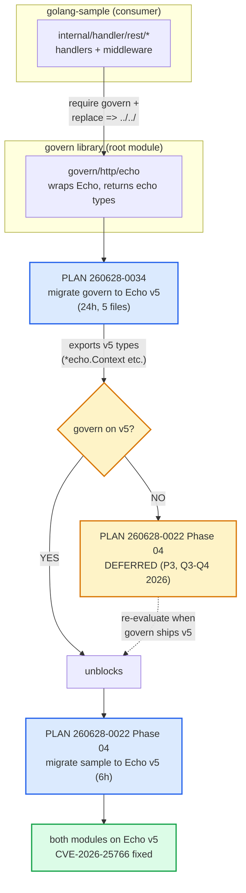
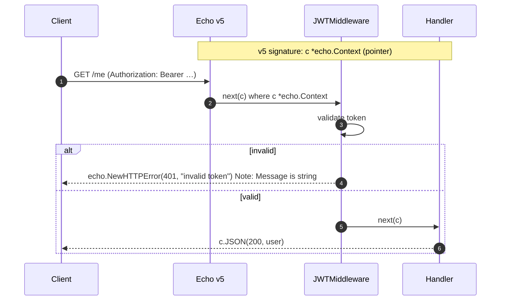

# Visual Explanation: Echo v5 Migration

## Overview

The repo uses **Echo v4.15.1** today (`github.com/labstack/echo/v4`), in **both modules**: the
`govern` library (root) and the `golang-sample` app (`examples/`). Echo v5 is a **major release
with breaking API changes** — not a drop-in bump.

The migration is split across **two plans** that form a hard dependency chain:

| Plan | Scope | Status | Effort |
|------|-------|--------|--------|
| `260628-0034-govern-echo-v5-upgrade` | migrate **govern** → v5 | pending | 24h |
| `260628-0022-upgrades-plan` Phase 04 | migrate **sample** → v5 | **DEFERRED** (P3, Q3-Q4 2026) | 6h |

**The one-line story:** govern must move to v5 *first*; the sample's migration is blocked until
govern exports v5 types — so the sample plan defers it.

---

## Quick View (ASCII)

```
        ┌─────────────────────────────────────────────────────────────┐
        │   WHY THE SAMPLE CAN'T MOVE TO v5 ALONE                     │
        └─────────────────────────────────────────────────────────────┘

   golang-sample (consumer)                 govern (root library)
   ┌──────────────────────┐                 ┌────────────────────────┐
   │ handler.go           │  imports        │ http/echo              │
   │ middlewares/*.go     │ ───────────────▶│  - jwt.go              │
   │ controllers/auth/*   │   require +     │  - middleware.go       │
   │                      │   replace ../../│  - swagger.go          │
   │ uses: echo.Context   │                 │  - trim.go             │
   │ uses: echo.HTTPError │                 │                        │
   └──────────────────────┘                 │ EXPOSES echo types:    │
            ▲                                │  echo.MiddlewareFunc   │
            │ sample's handlers must         │  func(*echo.Context)   │
            │ match echo's version           │  (return values)       │
            │                                └───────────┬────────────┘
            │                                            │
            └────────────  coupled  ─────────────────────┘
                 both pinned to the SAME echo major version

   ⟹ If govern stays on v4, the sample CANNOT jump to v5
     (signature clash: echo.Context  vs  *echo.Context)
   ⟹ Govern migrates FIRST (260628-0034), then sample follows (260628-0024 P04)
```

```
   DECISION FLOW (per plan 260628-0022)

   Echo v4.15.1 today ──► stable, no CVE on Linux ──► KEEP for now
        │
        ├─ Windows deploy? ──► CVE-2026-25766 (path traversal) ──► needs v5.0.3+
        │
        └─ govern supports v5? ──► NO (today) ──► DEFER sample migration (P3)
                                  YES (after 260628-0034) ──► migrate sample
```

---

## Detailed Flow

### The dependency chain & trigger conditions



### What a single handler changes (v4 → v5)



---

## Key Concepts — the breaking changes

Five categories of change drive the 15+ edits. The first three touch **every handler/middleware**,
which is why risk is rated MEDIUM-HIGH.

### 1. Context is now a pointer (HIGH — everywhere)

```go
// ❌ v4
func handler(c echo.Context) error
func (mw) return func(c echo.Context) error { ... }

// ✅ v5  — pointer required
func handler(c *echo.Context) error
func (mw) return func(c *echo.Context) error { ... }
```
Blast radius: **all** handlers + all middleware signatures.

### 2. Error handler param swap (HIGH)

```go
// ❌ v4
func customHTTPErrorHandler(err error, c echo.Context)

// ✅ v5  — context first, error second
func customHTTPErrorHandler(c *echo.Context, err error)
```
Blast radius: `internal/handler/rest/handler.go` (the centralized error handler).

### 3. HTTPError.Message is now `string` (MED)

```go
// ❌ v4 — Message is interface{}, fmt.Sprintf accepted
return echo.NewHTTPError(401, fmt.Sprintf("invalid token: %s", err))

// ✅ v5 — Message is string; no formatting object
return echo.NewHTTPError(401, "invalid token")  // build the string yourself first
```
Blast radius: every `NewHTTPError(..., fmt.Sprintf(...))` call site.

### 4. Logger → `*slog.Logger` (MED)

Echo's logger interface replaced by stdlib `log/slog`. Affects any `e.Logger = ...` wiring and
echo's built-in logger middleware — needs a `*slog.Logger` adapter.

### 5. Response type change (MED)

Echo's `Response` returned type changes to `http.ResponseWriter`. Code reading echo's response
fields (e.g. `c.Response().Write(...)`, status access) must be re-checked.

> Bonus: **CVE-2026-25766** (path traversal on Windows) is the security driver, fixed in v5.0.3+.
> High urgency only for Windows deployments; low for Linux.

---

## Code Example — before/after side by side

```go
// ─────────────────────────────────────────────────────────────
// v4 (current)                       v5 (target)
// ─────────────────────────────────────────────────────────────

// handler
func GetMe(c echo.Context) error {     func GetMe(c *echo.Context) error {
    claims, ok :=                          claims, ok :=
        echo.GetCurrentUser(c)                 echo.GetCurrentUser(c)
    if !ok {                                if !ok {
        return echo.NewHTTPError(              return echo.NewHTTPError(
            http.StatusUnauthorized,               http.StatusUnauthorized,
            fmt.Sprintf("no user: %v", c.Path()))  "no user")          // string only
    }                                       }
    return c.JSON(200, claims)              return c.JSON(200, claims)
}                                       }

// middleware
func Trim(next echo.HandlerFunc)        func Trim(next echo.HandlerFunc)
    echo.HandlerFunc {                      echo.HandlerFunc {
    return func(c echo.Context)             return func(c *echo.Context)  // pointer
        error { ... }                           error { ... }
}                                       }

// error handler
func eh(err error,                      func eh(c *echo.Context,       // swapped
    c echo.Context) {                        err error) {
    ...                                       ...
}                                       }
```

---

## Blast Radius & Decision Summary

**govern side (plan 260628-0034) — 5 files:**
`http/echo/jwt.go` · `http/echo/middleware.go` · `http/echo/swagger.go` · `http/echo/trim.go` · `http/echo/context_test.go`

**sample side (plan 260628-0022 P04) — once unblocked:**
`internal/handler/rest/handler.go` (error handler) · `internal/handler/rest/middlewares/*.go` · `internal/handler/rest/controllers/auth/auth.go` · `go.mod`

| Question | Answer |
|----------|--------|
| Why defer the sample migration? | Govern still on v4 → sample's handlers would clash on `echo.Context` vs `*echo.Context`. Coupled majors. |
| When does it unblock? | After plan 260628-0034 ships govern with v5 types. |
| Is v4 unsafe today? | On Linux, no. CVE-2026-25766 is Windows-only (path traversal). |
| Rollback? | Trivial per-module: `go get github.com/labstack/echo/v4@latest` + revert signatures. |
| First step when ready? | Govern migrates (P01–P05), then sample does global `sed` for import path + `*echo.Context`, then manual error-handler/HTTPError fixes. |
